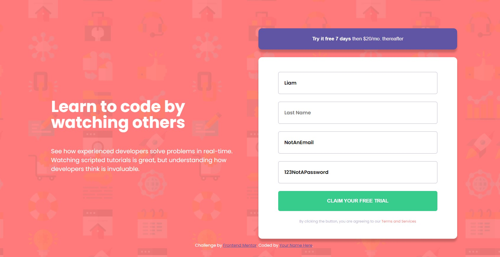

## Frontend Mentor || Intro Sign up Page

This is the completed solution I came up with for the Frontend Mentor Intro Sign Up page challenge! 

Within this project, I strictly used HTML, CSS, and vanilla Javascript. No CSS frameworks. This challenge was fun and helped me improve on many aspects of CSS and Javascript.
